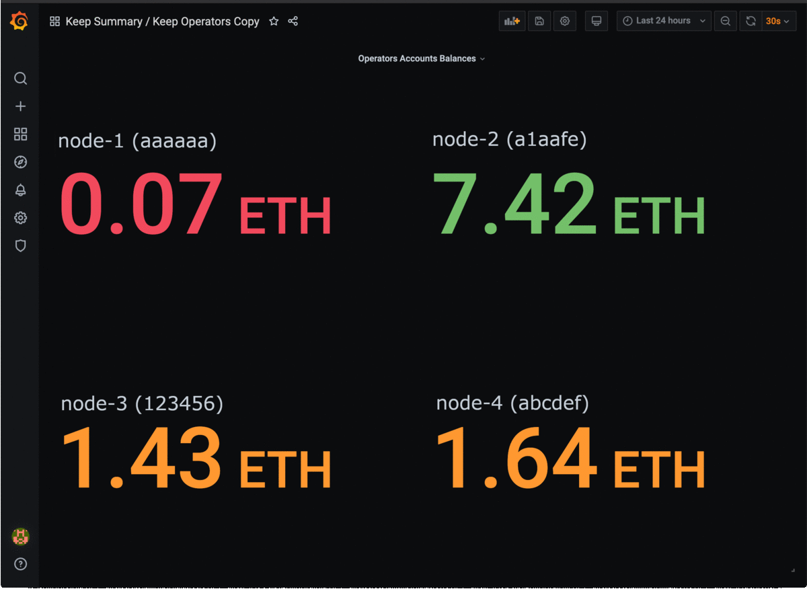

:toc: macro

= Keep Network Monitoring System from Boar Network

This repository contains tools for monitoring
https://github.com/keep-network/keep-core[keep-core]
and
https://github.com/keep-network/keep-ecdsa[keep-ecdsa]
clients of https://keep.network[Keep Network].

This is a complete solution for real-time monitoring health of Keep clients and
systems they are running on, including client and system-level alerts pushed to
Opsgenie mobile client of an on-call engineer, Ethereum connectivity health checks,
and operator account balances monitoring.

This repository does not contain any tools for key shares backups, operator key
backups, secure access to them, cluster relocation, and other infrastructure-level
features that should be supported by a production-grade deployment.

The tools support monitoring of:

- Keep Network clients, including metrics exposed by the client and client logs,

- host machines the clients are working on,

- ethereum accounts balances for Keep Network operators.

The configuration includes pre-defined sets of <<Dashboards>> and <<Alerts>>.

<<Alerts>> integration with <<Slack>> and <<Opsgenie>> is supported.



---

:icons: font
:numbered:
toc::[]

== Installation

To install the monitoring system first clone this repository on your machine:

```sh
git clone git@github.com:boar-network/keep-monitoring.git
```

Then, install Docker and Docker Compose and run:

```sh
docker-compose up
```

Containers named `prometheus` and `grafana` will be up and running.

The Grafana dashboard will be accessible on port `8080` (http://localhost:8080/).
Use `admin/admin` credentials when signing in for the first time.

For guidance on setting up nodes to be monitored see <<Monitoring Targets>> section. 

== Monitoring Targets

To add monitoring targets you should first configure target endpoints and add them
to the monitoring system.

=== Target Endpoints Configuration

Several types of target endpoints can be handled by the monitoring system:

- Client-level metrics endpoint
+
To expose client-level metrics endpoint of `keep-core` or `keep-ecdsa`
just make sure the `Metrics.Port` config property is set. Everything else
works out of the box.
+
For further details, here is the list of pull requests introducing
client-level metrics:
+
// TODO: Update links to keep documentation once available.
** https://github.com/keep-network/keep-common/pull/40[Metrics core package in keep-common]
** https://github.com/keep-network/keep-core/pull/1850[Metrics for keep-core]
** https://github.com/keep-network/keep-ecdsa/pull/479[Metrics for keep-ecdsa]
- System-level metrics endpoint
+
Exposing system-level metrics is a little bit harder as it depends on the
platform.
+
For *NIX systems you should use the
https://github.com/prometheus/node_exporter[Node Exporter] tool. Installation
instructions are described https://prometheus.io/docs/guides/node-exporter[here].
+
You can also use the predefined Ansible playbook to install the node exporter
automatically on the target machine and expose it on port `9602` by running:
+
```
ansible-playbook -i <user>@<machine>, -e "ansible_port=<ssh_port>" ./ansible-playbooks/linux-node-exporter.yml
```
- Accounts balances endpoint
+
The accounts balance monitoring component is working out of the box.

=== Ethereum Connection

Ethereum accounts monitoring requires connection to Ethereum API. This can be Geth,
Alchemy, Infura or any other service.

Configure `GETH` variable with URL to the Ethereum API in `./balance-exporter/variables.env` file.
(link:./balance-exporter/variables.env.SAMPLE)[Sample file])


=== Adding Targets To The Monitoring System

Adding new monitoring targets depends on their type:

- Client-level metrics endpoint
+
Add the new endpoint address to the `targets` array of
the link:./prometheus/clients-targets.json[] file.
- System-level metrics endpoint
+
Add the new endpoint address to the `targets` array of
the link:./prometheus/systems-targets.json[] file.
- Account balance
+
Add the new account's address to `./balance-exporter/addresses.txt` file.
Use the `name:address` format where `name` is an arbitrary value.
In the case of multiple accounts, put them in separate lines.
(link:./balance-exporter/addresses.txt.SAMPLE)[Sample file])

Prometheus will refresh automatically and you should see the new target
in the dashboard after a while.

== Alerts

=== Alerts Configuration

Alerts are emitted to the receivers configured in link:./alertmanager/alertmanager.yml[].

The configuration defines following pre-defined receivers: <<Slack>>, <<Opsgenie>>.

==== Slack

To use https://slack.com[Slack] notifications, two properties should be set in the
`./alertmanager/alertmanager.yml` config file:

- `receivers.slack_configs.api_url`: should contain an URL of the Slack incoming webhook.
- `receivers.slack_configs.channel`: must be set to the same channel as defined in the webhook configuration.

==== Opsgenie

To use https://www.atlassian.com/software/opsgenie[Opsgenie] notifications, three properties should be set in the
`./alertmanager/alertmanager.yml` config file:

- `receivers.opsgenie_configs.api_key`: should contain API key of the Opsgenie API integration
- `receivers.opsgenie_configs.api_url`: should be set to the correct value
depending on the chosen data center region
- `receivers.opsgenie_configs.responders`: should point to the desired alert responders configured in Opsgenie

=== Alerts Rules

Installed Prometheus instance contains several predefined alerts corresponding
to the predefined Grafana dashboards. Those alerts are defined in link:./prometheus/alert-rules.yml[] file. 

Rules reconfiguration requires Prometheus container restart.

Alerts corresponding to the clients:

- `ClientDown`: fired when a client goes down
- `EthConnectivityDown`: fired when a connection with the ethereum node is down
- `LowConnectedPeersCount`: fired when connected peers count falls below `5`
- `LowConnectedBootstrapCount`: fired when connected bootstrap count falls below `2`

Alerts corresponding to the systems:

- `SystemDown`: fired when a system goes down
- `HighCpuUsage`: fired when system CPU usage goes above `90%`
- `HighMemoryUsage`: fired when system memory usage goes above `90%`
- `HighDiskSpaceUsage`: fired when system disk space usage goes above `90%`

Alerts corresponding to the ethereum account balances:

- `LowAccountBalance`: fired when given account's balance falls below `1 ETH`

== Dashboards

Installed Grafana instance contains few predefined dashboards:

- `Keep Balances`: contains balances of monitored operators ethereum accounts,

- `Keep Clients`: contains client-level metrics such as
`connected_peers_count` and similar. You can change the observed client
using the `client` dropdown in the top left corner,

- `Keep Systems`: contains system-level metrics such as
CPU and memory usage. You can change the observed system
using the `system` dropdown in the top left corner.

There are also Summary dashboards available, aggregating metrics for all the configured nodes.

image:./docs/img/sample-eth-balances.png[Keep Balances Dashboard Sample,300,link="./docs/img/sample-eth-balances.png?raw=true"] 
image:./docs/img/sample-keep-clients.png[Keep Clients Dashboard Sample,300,link="./docs/img/sample-keep-clients.png?raw=true"]
image:./docs/img/sample-keep-systems.png[Keep Systems Dashboard Sample,300,link="./docs/img/sample-keep-systems.png?raw=true"]

== Client Logs Monitoring

A bundled solution for logs monitoring is currently under development. For the time
being you should configure a log exporter and aggregator of your choice to gather
the logs and define alerting rules.

One of the possible solutions is using https://logz.io/[Logz.io].

=== Logz.io

The logs should be delivered to the Logz.io's endpoint using one of the supported
link:https://docs.logz.io/shipping[shipping solutions], e.g. 
(link:https://docs.logz.io/shipping/log-sources/filebeat.html[Filebeat]).

Once the logs are delivered to Logz.io you should define a log parsing rule.
This can be done in `Tools` -> `Data Parsing` (see: link:https://docs.logz.io/user-guide/mapping-and-parsing/data-parsing-wizard.html[documentation]). 

A patter you can use for parsing the log messages:
```
"^%{TIMESTAMP_ISO8601:timestamp}\\s+%{LOGLEVEL:level}\\s+%{DATA:module}\\s+%{GREEDYDATA:message}"
```

In case of any problems feel free to contact Logz.io Support team via chat and
send them sample parsing configuration shared in the link:.logs/config/logzio-keep-parsing.json[] file.

After the logs are parsed correctly you can start configuring link:https://docs.logz.io/user-guide/alerts[Alerts].
We recommend you create: 

- `severe` severity alerts for any `CRITICAL`, `DPANIC`, `PANIC` or `FATAL` level messages,

- `high` severity alerts for any `ERROR` level messages,

- `medium` severity alerts for `WARN` level messages.

You can use many popular link:https://docs.logz.io/user-guide/integrations/endpoints.html[notification endpoints]
including Slack, Opsgenie or PagerDuty.

---

Tools developed by the https://boar.network/[Boar Network]
ifdef::env-github[]
:boar:
endif::[]
team with great
contributions from 
link:https://github.com/lukasz-zimnoch[lukasz-zimnoch], 
link:https://github.com/nkuba[nkuba], and
link:https://github.com/pdyraga[pdyraga].
